# R을 이용한 한국어 학술데이터 텍스트마이닝

[](LICENSE)
[](https://github.com/rubato103/textmining_KCI_RISS/commits/main)
[](https://github.com/rubato103/textmining_KCI_RISS)
[](https://github.com/rubato103/textmining_KCI_RISS/actions)

한국어 학술 논문 데이터를 대상으로 한 형태소 분석, N그램 추출, 토픽 모델링 통합 파이프라인

📚 [기여 가이드](CONTRIBUTING.md) | 📦 [설정 파일](DESCRIPTION) | 🧪 [테스트](tests/)

## 프로젝트 개요

### 주요 기능

- **다중 데이터 소스 지원**: KCI 및 RISS Excel 데이터 자동 통합
- **고성능 형태소 분석**: Kiwipiepy 및 CoNg 모델 병렬 처리
- **사용자 사전 최적화**: N그램 분석 기반 복합명사 자동 추천
- **STM 토픽 모델링**: 메타데이터 기반 시계열 및 범주 분석
- **완전 자동화**: 대화형 인터페이스를 통한 원클릭 실행

### 기술 스택

- **언어**: R 4.5.1 이상
- **형태소 분석기**: [Kiwipiepy](https://github.com/bab2min/kiwipiepy), CoNg 모델
- **토픽 모델링**: STM (Structural Topic Model)
- **병렬 처리**: R parallel 패키지
- **시각화**: ggplot2, wordcloud

## 주요 워크플로우

```mermaid
graph LR;
    A("Excel 데이터 입력<br>(KCI, RISS)") --> B("데이터 로딩 및 표준화<br>(Script.1)");
    B --> C("형태소 분석<br>(Script.2)");
    C --> D("N그램 분석<br>(Script.3-1)");
    D --> I("LLM 활용 복합명사 검토<br>(Script.3-2)");
    I --"사용자 검토 및 수정"--> E("사용자 사전 생성<br>(Script.3-3)");
     %% Loop for iterative refinement (from E to C)
    E --> C
    C --> F("DTM 생성<br>(Script.4)");
    F -- "동의어, 불용어 처리" --> G("STM 토픽 모델링<br>(Script.5)");
    G --> H("분석 보고서 및 결과");
   

    style A fill:#f9f,stroke:#333,stroke-width:2px
    style H fill:#f9f,stroke:#333,stroke-width:2px
```



## 프로젝트 구조

```
textming_KCI_RISS/
├── scripts/                 # 모든 R 스크립트
├── data/
│   ├── raw_data/            # 원본 Excel 데이터 (Git 추적 제외)
│   ├── processed/           # 처리된 결과 (Git 추적 제외)
│   ├── dictionaries/        # 사용자 사전 (Git 추적 제외)
│   └── config/              # 설정 파일 (버전 관리 포함)
│       └── compound_mappings.csv  # 복합어 정규화 매핑
├── reports/                 # 분석 보고서 (Git 추적 제외)
├── CITATION.md              # 인용 가이드
├── LICENSE                  # 라이선스 정보
└── cong-base/              # CoNg 모델 (Git 추적 제외)
```

## 빠른 시작

### 1. 자동 설정 (권장)

프로젝트 루트 디렉토리에서 setup 스크립트를 실행하세요:

```r
source("setup.R")
```

setup.R 스크립트는 다음을 자동으로 수행합니다:
- 필수 R 패키지 설치
- Python 환경 확인
- Kiwipiepy 설치
- 프로젝트 디렉토리 구조 생성
- 설정 파일 확인

### 1-1. 수동 설정

```r
# 필수 패키지 설치
packages <- c("readxl", "dplyr", "tidyr", "stringr", "parallel",
              "stm", "ggplot2", "wordcloud", "reticulate")
install.packages(packages)

# Python 환경 (Kiwipiepy)
pip install kiwipiepy
```

### 2. 데이터 준비

```bash
# KCI 또는 RISS Excel 파일을 data/raw_data/ 폴더에 복사
```

### 3. 전체 파이프라인 실행

**중요**: 반드시 scripts 디렉토리에서 실행하세요.

```r
source("scripts/00_run_pipeline.R")
run_morpheme_analysis_pipeline(steps = 1:5, auto_mode = TRUE)
```

#### 개별 스크립트 실행

```r
# 1단계: 데이터 로딩 및 분석
source("scripts/01_data_loading_and_analysis.R")

# 2단계: 형태소 분석 (대화형)
source("scripts/02_kiwipiepy_mopheme_analysis.R")

# 3단계: N그램 분석
source("scripts/03-1_ngram_analysis.R")

# 사용자 사전 생성
source("scripts/03-3_create_user_dict.R")

# DTM 생성
source("scripts/04_quanteda_dtm_creation.R")

# 토픽 모델링
source("scripts/05_stm_topic_modeling.R")
```

## 주요 특징

### 다중 데이터 소스 호환성

- **KCI**: 고유 논문 ID 기반
- **RISS**: 해시 기반 고유 ID 자동 생성
- **동일한 파이프라인**으로 두 데이터 모두 처리
- 

### 지능형 사전 관리

- **N그램 기반**: 복합명사 자동 발견
- **빈도 필터링**: 의미 있는 용어만 선별
- **사용자 검토**: 수동 검토 후 사전 등록

### 복합어 정규화 설정

복합어 매핑은 `data/config/compound_mappings.csv` 파일에서 관리됩니다:

```csv
pattern,replacement,description
비자살적 자해,비자살적자해,복합명사 정규화
로지스틱 회귀,로지스틱회귀,통계 용어 정규화
매개 효과,매개효과,연구 방법론 용어
```

- **유연한 관리**: CSV 파일 수정으로 매핑 추가/제거 가능
- **자동 로드**: DTM 생성 시 자동으로 적용
- **폴백 지원**: 파일이 없을 경우 기본 매핑 사용

### 패키지 관리

중앙 집중식 패키지 관리 시스템이 제공됩니다:

```r
# 00_utils.R에 포함된 패키지 관리 함수
source("scripts/00_utils.R")

# 여러 패키지 일괄 설치 및 로드
packages <- c("dplyr", "ggplot2", "stringr")
ensure_packages(packages)

# 미러 자동 전환 패키지 설치
install_with_fallback("stm")
```

**특징**:
- CRAN 미러 자동 폴백 (4개 미러)
- 설치 성공/실패 상태 리포트
- 통합된 에러 처리


## 기여하기

### 협업 환영

**추가 개발, 확장, 연구 협업을 환영합니다!**

특히 다음 분야의 협업을 기대합니다:

- **교육학 연구**: 교육 정책, 제도와 관련된 대량의 텍스트 분석
- **텍스트마이닝 방법론**: 한국어 NLP, 토픽 모델링, 감정 분석 기법 개발, 텍스트마이닝 전반

협업 가능 영역:

- **연구 협업**: 공동 연구 프로젝트 및 학술 논문 작성
- **기능 개발**: 새로운 분석 기법이나 성능 개선
- **확장 모듈**: 추가적인 텍스트마이닝 방법론 구현

협업 문의:

- Email: rubato103@dodaseo.cc

## 인용 (Citation)

**중요**: 본 코드를 활용할 경우 반드시 인용 표기 바랍니다.

### 이 파이프라인 인용

```
양연동. (2025). R을 이용한 한국어 학술데이터 텍스트마이닝. GitHub Repository. https://github.com/rubato103/textmining_KCI_RISS
```

```
Yang, Y. (2025). Text Mining of Korean Academic Data using R. GitHub Repository. https://github.com/rubato103/textmining_KCI_RISS
```

### Kiwi 형태소 분석기 인용 (필수)

```
이민철. (2024). Kiwi: 통계적 언어 모델과 Skip-Bigram을 이용한 한국어 형태소 분석기 구현. 
디지털인문학, 1(1), 109-136. https://doi.org/10.23287/KJDH.2024.1.1.6
```

**상세한 인용 가이드**: [CITATION.md](CITATION.md)

## 라이선스

본 프로젝트는 **학술 및 교육용 라이선스**를 따릅니다.

### 허용되는 사용

- **학술 연구** 및 논문 발표
- **교육 목적** (대학, 학교 등)
- **비영리 연구** 활동
- **개인 학습** 및 연구

### 금지되는 사용

- **상업적 이용** (컨설팅, 분석 서비스 등)
- **수익 창출** 목적 사용
- **기업 제품/서비스**에 포함

### 로그 확인

분석 과정의 상세 로그는 `reports/` 폴더의 각 단계별 보고서에서 확인 가능합니다.

---

# Text Mining Korean Academic Data using R

[한국어 버전 보기](#r을-이용한-한국어-학술데이터-텍스트마이닝) | **English Version**

[](LICENSE)
[](https://github.com/rubato103/textmining_KCI_RISS/commits/main)
[](https://github.com/rubato103/textmining_KCI_RISS)
[](https://github.com/rubato103/textmining_KCI_RISS/actions)

An integrated pipeline for morphological analysis, N-gram extraction, and topic modeling of Korean academic paper data.

📚 [Contributing Guide](CONTRIBUTING.md) | 📦 [Package Info](DESCRIPTION) | 🧪 [Tests](tests/)

## Project Overview

### Key Features

- **Multi-source Data Support**: Automatic integration of KCI and RISS Excel data
- **High-Performance Morphological Analysis**: Parallel processing with Kiwipiepy and CoNg model
- **Smart Dictionary Optimization**: Automatic compound noun recommendations based on N-gram analysis
- **STM Topic Modeling**: Time-series and categorical analysis with metadata
- **Fully Automated**: One-click execution with interactive interface

### Tech Stack

- **Language**: R 4.5.1 or higher
- **Morphological Analyzer**: [Kiwipiepy](https://github.com/bab2min/kiwipiepy), CoNg model
- **Topic Modeling**: STM (Structural Topic Model)
- **Parallel Processing**: R parallel package
- **Visualization**: ggplot2, wordcloud

## Workflow


## Project Structure

```
textming_KCI_RISS/
├── scripts/                 # All R scripts
├── data/
│   ├── raw_data/            # Raw Excel data (excluded from Git)
│   ├── processed/           # Processed results (excluded from Git)
│   ├── dictionaries/        # User dictionaries (excluded from Git)
│   └── config/              # Configuration files (version controlled)
│       └── compound_mappings.csv  # Compound word normalization mappings
├── reports/                 # Analysis reports (excluded from Git)
├── CITATION.md              # Citation guide
├── LICENSE                  # License information
└── cong-base/              # CoNg model (excluded from Git)
```

## Quick Start

### 1. Automated Setup (Recommended)

Run the setup script from the project root directory:

```r
source("setup.R")
```

The setup.R script automatically performs the following:
- Install required R packages
- Verify Python environment
- Install Kiwipiepy
- Create project directory structure
- Verify configuration files

### 1-1. Manual Setup

```r
# Install required packages
packages <- c("readxl", "dplyr", "tidyr", "stringr", "parallel",
              "stm", "ggplot2", "wordcloud", "reticulate")
install.packages(packages)

# Python environment (Kiwipiepy)
pip install kiwipiepy
```

### 2. Data Preparation

```bash
# Copy KCI or RISS Excel files to data/raw_data/ folder
```

### 3. Run Full Pipeline

**Important**: Execute from the scripts directory.

```r
source("scripts/00_run_pipeline.R")
run_morpheme_analysis_pipeline(steps = 1:5, auto_mode = TRUE)
```

#### Running Individual Scripts

```r
# Step 1: Data Loading and Analysis
source("scripts/01_data_loading_and_analysis.R")

# Step 2: Morphological Analysis (Interactive)
source("scripts/02_kiwipiepy_mopheme_analysis.R")

# Step 3: N-gram Analysis
source("scripts/03-1_ngram_analysis.R")

# User Dictionary Creation
source("scripts/03-3_create_user_dict.R")

# DTM Creation
source("scripts/04_quanteda_dtm_creation.R")

# Topic Modeling
source("scripts/05_stm_topic_modeling.R")
```

## Key Features

### Multi-source Data Compatibility

- **KCI**: Based on unique paper IDs
- **RISS**: Automatic hash-based unique ID generation
- **Unified Pipeline**: Process both data sources seamlessly

### Intelligent Dictionary Management

- **N-gram Based**: Automatic compound noun discovery
- **Frequency Filtering**: Select only meaningful terms
- **User Review**: Manual review before dictionary registration

### Compound Word Normalization

Compound word mappings are managed in the `data/config/compound_mappings.csv` file:

```csv
pattern,replacement,description
비자살적 자해,비자살적자해,Compound noun normalization
로지스틱 회귀,로지스틱회귀,Statistical term normalization
매개 효과,매개효과,Research methodology term
```

**Features**:
- **Flexible Management**: Add/remove mappings by editing CSV file
- **Auto-loading**: Automatically applied during DTM creation
- **Fallback Support**: Use default mappings if file is missing

### Package Management

Centralized package management system is provided:

```r
# Package management functions in 00_utils.R
source("scripts/00_utils.R")

# Batch install and load multiple packages
packages <- c("dplyr", "ggplot2", "stringr")
ensure_packages(packages)

# Install package with automatic mirror fallback
install_with_fallback("stm")
```

**Features**:
- Automatic CRAN mirror fallback (4 mirrors)
- Installation success/failure status report
- Integrated error handling

## Contributing

### Collaboration Welcome

**We welcome contributions, extensions, and research collaborations!**

Areas of interest:

- **Educational Research**: Large-scale text analysis related to education policy and systems
- **Text Mining Methodology**: Korean NLP, topic modeling, sentiment analysis, and general text mining techniques

Collaboration opportunities:

- **Research Collaboration**: Joint research projects and academic paper writing
- **Feature Development**: New analysis techniques or performance improvements
- **Extension Modules**: Implementation of additional text mining methodologies

Contact:

- Email: rubato103@dodaseo.cc

## Citation

**Important**: Please cite this repository if you use this code.

### Citing This Pipeline

```
Yang, Y. (2025). Text Mining of Korean Academic Data using R. GitHub Repository. https://github.com/rubato103/textmining_KCI_RISS
```

```
양연동. (2025). R을 이용한 한국어 학술데이터 텍스트마이닝. GitHub Repository. https://github.com/rubato103/textmining_KCI_RISS
```

### Citing Kiwi Morphological Analyzer (Required)

```
Lee, M. (2024). Kiwi: Implementation of Korean Morphological Analyzer using Statistical Language Model and Skip-Bigram.
Korean Journal of Digital Humanities, 1(1), 109-136. https://doi.org/10.23287/KJDH.2024.1.1.6
```

**Detailed citation guide**: [CITATION.md](CITATION.md)

## License

This project follows an **Academic and Educational Use License**.

### Permitted Uses

- **Academic research** and paper publications
- **Educational purposes** (universities, schools, etc.)
- **Non-profit research** activities
- **Personal learning** and research

### Prohibited Uses

- **Commercial use** (consulting, analysis services, etc.)
- **Revenue generation** purposes
- **Incorporation into corporate products/services**

### Log Files

Detailed logs of the analysis process are available in step-by-step reports in the `reports/` folder.
